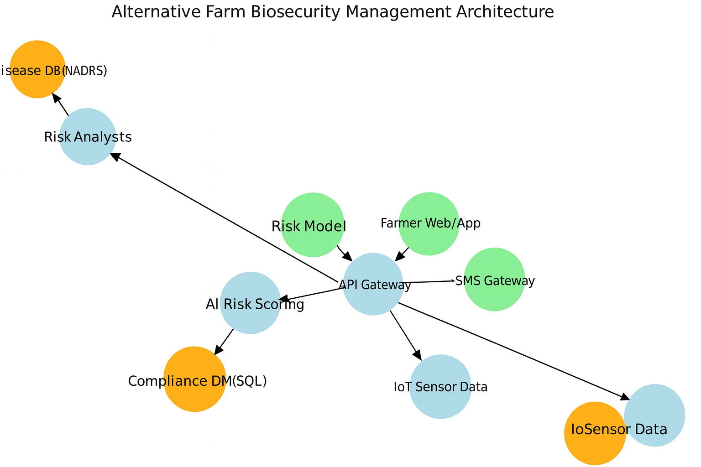

# Smart India Hackathon Workshop
# Date: 26.11.25
## Referece Number: 212224230208
## Name: PRIYA B
## Problem Title
SIH 25006: Development of a Digital Farm Management Portal for implementing Biosecurity measures in Pig and Poultry Farms
## Problem Description
### Background

Biosecurity is a cornerstone of animal health management, particularly in the pig and poultry sectors, where disease outbreaks such as Avian Influenza and African Swine Fever can cause significant economic losses, threaten food security, and disrupt rural livelihoods. Despite its importance, many farmers—especially smallholders in resource-limited areas—struggle to access practical, actionable information on biosecurity protocols, risk assessment tools, and regulatory compliance requirements.

### Problem Description

There is an urgent need for a user-friendly, digital platform that empowers farmers to implement, monitor, and sustain robust biosecurity practices on their farms. This portal should offer end-to-end solutions for farm-level biosecurity management by integrating:

• Customizable risk assessment tools based on local epidemiological conditions.
• Interactive training modules and best practice guidelines tailored for pig and poultry production systems.
• Compliance tracking features aligned with regulatory frameworks to help farmers work toward disease-free compartment recognition.
• Real-time alerts and monitoring dashboards for disease outbreaks and biosecurity breaches.
• Multilingual and mobile-first design to ensure accessibility in remote and rural areas.

The platform should also enable data collection and analysis for policy support, foster collaborative networking among stakeholders (farmers, veterinarians, extension workers, etc.), and promote long-term resilience and sustainability in the livestock sector.

### Expected Outcomes

• Enhanced farmer awareness and education on biosecurity.
• Improved risk management at the farm level as well as self-assessment.
• Easy access to customized biosecurity protocols and guidelines.
• Digital record-keeping and compliance tracking.
• Timely alerts and disease notifications to farmers.
• Healthier livestock and increased farm productivity.
• Empowerment of small and marginal farmers with limited resources.
• Support to authorities in data-driven surveillance and policy making.
• Stronger collaboration across the livestock ecosystem.
• Improved national preparedness for zoonotic and transboundary diseases.

## Problem Creater's Organization
Ministry of Fisheries, Animal Husbandry & Dairying

## Theme
Department of Animal Husbandry & Dairying (DoAH&D)

## Proposed Solution

### 1. Proposed solution
A digital Farm Biosecurity Management Portal that provides AI-based risk assessment, multilingual biosecurity training, digital compliance tracking, and real-time disease alerts for pig and poultry farms.

### 2. Addresses the problem
It improves farmer awareness, gives farm-specific risk scores, provides customized biosecurity protocols, keeps digital records for audits, and alerts farmers about nearby outbreaks—solving the lack of guidance, monitoring, and preparedness.

### 3. Innovation and uniqueness 
First integrated platform combining AI + IoT + compliance tracking; offers offline access, regional languages, farm-specific SOP generation, and data dashboards for authorities.

## Technical Approach

### 1. Technologies used
Frontend (React/PWA), Backend (Node.js/Python), Database (PostgreSQL/MongoDB), ML models (scikit-learn/TensorFlow), optional IoT sensors (ESP32, DHT22).

### 2. Methodology 
Requirement study → System design → ML model creation → Web/app development → IoT integration → Testing → Deployment.

#### Flow (Short):
Farmer inputs → AI risk score → Compliance logs → Alerts & guidance → Dashboard → Govt analytics.

## Feasibility and Viability

### 1. Feasibility 
Technically doable with existing ML, GIS, and web technologies; operationally feasible due to simple UI and multilingual support.

### 2. Challenges 
Low digital literacy, poor internet, inaccurate inputs, IoT reliability.

### 3. Strategies 
Offline mode, icon/video-based UI, auto-validation of inputs, ruggedized sensors with alerts.

## Impact and Benefits

### 1. Impact 
Enhances farmer awareness, reduces disease outbreaks, improves farm productivity, and strengthens national biosecurity preparedness.

### 2. Benefits 
Social: Better hygiene & safer livestock.
Economic: Lower losses, higher income.
Environmental: Improved sanitation & waste management.

## Research and References
### 1. Reference 
DAHD Biosecurity Guidelines (Govt of India)
FAO & OIE biosecurity manuals
NADRS+ disease surveillance data
Research papers on AI-based livestock disease prediction
IoT sensor documentation (ESP32, DHT22)

## Flowchart

